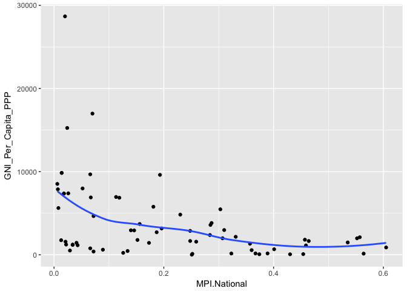
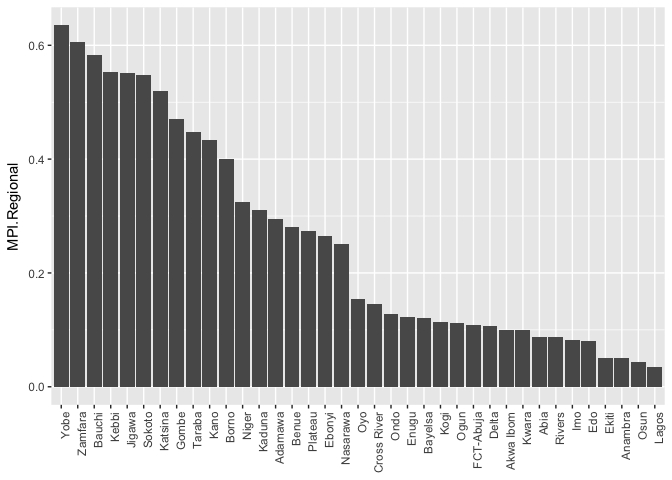
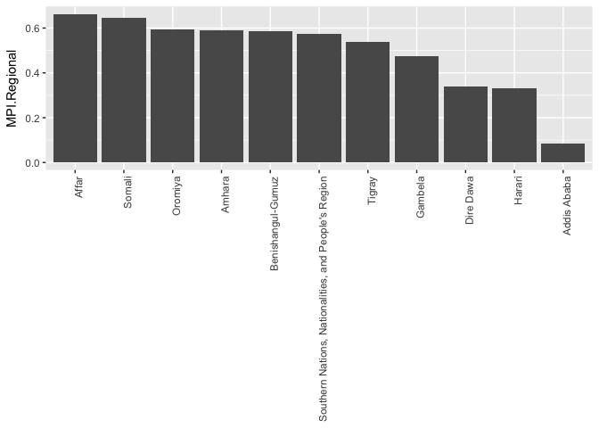
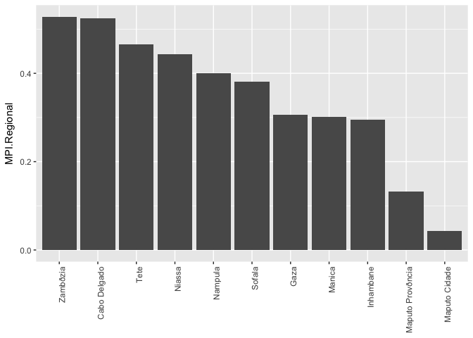

This is an exploration of several Development focused Data sets.


```r
library(ggplot2)
library(tidyverse)
library(ggrepel)
library(kableExtra)
```

####Oxford Multidimensional Poverty Datasets 


```r
setwd('/Users/peterfinnerty/R Documents/Independent/Development_Projects/Datasets/Oxford_Dev')
national <- read.csv('MPI_national.csv')
subnational <- read.csv('MPI_subnational.csv')
```


MPI scores measure poverty on multiple dimensions for each country. They allow inter and intracountry comparisons of poverty, capturing more information than simple PPP thresholds.

###Top Ten Countries by Rural Poverty:

```r
national %>% 
  mutate(Rural.Rank = min_rank(-MPI.Rural)) %>% 
  select(Rural.Rank, Country, MPI.Rural) %>%
  arrange(desc(MPI.Rural)) %>% 
  head(10) %>% 
  kable() %>% 
  kable_styling(bootstrap_options = c("striped", "hover", "condensed"), full_width = FALSE, position = "left")
```

<table class="table table-striped table-hover table-condensed" style="width: auto !important; ">
 <thead>
  <tr>
   <th style="text-align:right;"> Rural.Rank </th>
   <th style="text-align:left;"> Country </th>
   <th style="text-align:right;"> MPI.Rural </th>
  </tr>
 </thead>
<tbody>
  <tr>
   <td style="text-align:right;"> 1 </td>
   <td style="text-align:left;"> Niger </td>
   <td style="text-align:right;"> 0.669 </td>
  </tr>
  <tr>
   <td style="text-align:right;"> 2 </td>
   <td style="text-align:left;"> Somalia </td>
   <td style="text-align:right;"> 0.651 </td>
  </tr>
  <tr>
   <td style="text-align:right;"> 3 </td>
   <td style="text-align:left;"> Ethiopia </td>
   <td style="text-align:right;"> 0.637 </td>
  </tr>
  <tr>
   <td style="text-align:right;"> 4 </td>
   <td style="text-align:left;"> Burkina Faso </td>
   <td style="text-align:right;"> 0.621 </td>
  </tr>
  <tr>
   <td style="text-align:right;"> 5 </td>
   <td style="text-align:left;"> Chad </td>
   <td style="text-align:right;"> 0.609 </td>
  </tr>
  <tr>
   <td style="text-align:right;"> 6 </td>
   <td style="text-align:left;"> Guinea </td>
   <td style="text-align:right;"> 0.591 </td>
  </tr>
  <tr>
   <td style="text-align:right;"> 6 </td>
   <td style="text-align:left;"> South Sudan </td>
   <td style="text-align:right;"> 0.591 </td>
  </tr>
  <tr>
   <td style="text-align:right;"> 8 </td>
   <td style="text-align:left;"> Sierra Leone </td>
   <td style="text-align:right;"> 0.551 </td>
  </tr>
  <tr>
   <td style="text-align:right;"> 9 </td>
   <td style="text-align:left;"> Mali </td>
   <td style="text-align:right;"> 0.530 </td>
  </tr>
  <tr>
   <td style="text-align:right;"> 10 </td>
   <td style="text-align:left;"> Central African Republic </td>
   <td style="text-align:right;"> 0.519 </td>
  </tr>
</tbody>
</table>

###Top Ten Countries by Urban Poverty:

```r
national %>% 
  mutate(Rural.Rank = min_rank(-MPI.Urban)) %>% 
  select(Rural.Rank, Country, MPI.Urban) %>%
  arrange(desc(MPI.Urban)) %>% 
  head(10) %>% 
  kable() %>% 
  kable_styling(bootstrap_options = c("striped", "hover", "condensed"), full_width = FALSE, position = "left")
```

<table class="table table-striped table-hover table-condensed" style="width: auto !important; ">
 <thead>
  <tr>
   <th style="text-align:right;"> Rural.Rank </th>
   <th style="text-align:left;"> Country </th>
   <th style="text-align:right;"> MPI.Urban </th>
  </tr>
 </thead>
<tbody>
  <tr>
   <td style="text-align:right;"> 1 </td>
   <td style="text-align:left;"> South Sudan </td>
   <td style="text-align:right;"> 0.459 </td>
  </tr>
  <tr>
   <td style="text-align:right;"> 2 </td>
   <td style="text-align:left;"> Chad </td>
   <td style="text-align:right;"> 0.351 </td>
  </tr>
  <tr>
   <td style="text-align:right;"> 3 </td>
   <td style="text-align:left;"> Somalia </td>
   <td style="text-align:right;"> 0.293 </td>
  </tr>
  <tr>
   <td style="text-align:right;"> 4 </td>
   <td style="text-align:left;"> Liberia </td>
   <td style="text-align:right;"> 0.290 </td>
  </tr>
  <tr>
   <td style="text-align:right;"> 5 </td>
   <td style="text-align:left;"> Central African Republic </td>
   <td style="text-align:right;"> 0.289 </td>
  </tr>
  <tr>
   <td style="text-align:right;"> 6 </td>
   <td style="text-align:left;"> Niger </td>
   <td style="text-align:right;"> 0.276 </td>
  </tr>
  <tr>
   <td style="text-align:right;"> 7 </td>
   <td style="text-align:left;"> Sierra Leone </td>
   <td style="text-align:right;"> 0.271 </td>
  </tr>
  <tr>
   <td style="text-align:right;"> 8 </td>
   <td style="text-align:left;"> Ethiopia </td>
   <td style="text-align:right;"> 0.230 </td>
  </tr>
  <tr>
   <td style="text-align:right;"> 9 </td>
   <td style="text-align:left;"> Congo, Democratic Republic of the </td>
   <td style="text-align:right;"> 0.228 </td>
  </tr>
  <tr>
   <td style="text-align:right;"> 10 </td>
   <td style="text-align:left;"> Burkina Faso </td>
   <td style="text-align:right;"> 0.226 </td>
  </tr>
</tbody>
</table>

###Countries with the Worst Regional Differences:

```r
max <- subnational %>% 
  group_by(Country) %>%
  filter(MPI.Regional == max(MPI.Regional)) %>%
  select(ISO.country.code, Country, Sub.national.region, MPI.Regional, MPI.National) %>% 
  rename(Highest.Region = Sub.national.region, Highest.MPI = MPI.Regional)
min <- subnational %>% 
  group_by(Country) %>%
  filter(MPI.Regional == min(MPI.Regional)) %>%
  select(ISO.country.code, Country, Sub.national.region, MPI.Regional, MPI.National) %>% 
  rename(Lowest.Region = Sub.national.region, Lowest.MPI = MPI.Regional)
gaps <- merge(max, min) %>% 
  mutate(MPI.Gap = Highest.MPI - Lowest.MPI)

gaps %>%
  mutate(Rank = min_rank(-MPI.Gap)) %>% 
  select(Rank, Country, Highest.Region, Lowest.Region, MPI.Gap) %>%
  arrange(Rank) %>% 
  head(10) %>% 
  kable() %>% 
  kable_styling(bootstrap_options = c("striped", "hover", "condensed"), 
                full_width = FALSE, position = "left")
```

<table class="table table-striped table-hover table-condensed" style="width: auto !important; ">
 <thead>
  <tr>
   <th style="text-align:right;"> Rank </th>
   <th style="text-align:left;"> Country </th>
   <th style="text-align:left;"> Highest.Region </th>
   <th style="text-align:left;"> Lowest.Region </th>
   <th style="text-align:right;"> MPI.Gap </th>
  </tr>
 </thead>
<tbody>
  <tr>
   <td style="text-align:right;"> 1 </td>
   <td style="text-align:left;"> Nigeria </td>
   <td style="text-align:left;"> Yobe </td>
   <td style="text-align:left;"> Lagos </td>
   <td style="text-align:right;"> 0.600 </td>
  </tr>
  <tr>
   <td style="text-align:right;"> 2 </td>
   <td style="text-align:left;"> Ethiopia </td>
   <td style="text-align:left;"> Affar </td>
   <td style="text-align:left;"> Addis Ababa </td>
   <td style="text-align:right;"> 0.578 </td>
  </tr>
  <tr>
   <td style="text-align:right;"> 3 </td>
   <td style="text-align:left;"> Uganda </td>
   <td style="text-align:left;"> Karamoja </td>
   <td style="text-align:left;"> Kampala </td>
   <td style="text-align:right;"> 0.558 </td>
  </tr>
  <tr>
   <td style="text-align:right;"> 4 </td>
   <td style="text-align:left;"> Cameroon </td>
   <td style="text-align:left;"> Extrðme-Nord </td>
   <td style="text-align:left;"> Douala </td>
   <td style="text-align:right;"> 0.516 </td>
  </tr>
  <tr>
   <td style="text-align:right;"> 5 </td>
   <td style="text-align:left;"> Afghanistan </td>
   <td style="text-align:left;"> Urozgan </td>
   <td style="text-align:left;"> Kabul </td>
   <td style="text-align:right;"> 0.507 </td>
  </tr>
  <tr>
   <td style="text-align:right;"> 6 </td>
   <td style="text-align:left;"> Burkina Faso </td>
   <td style="text-align:left;"> Est </td>
   <td style="text-align:left;"> Centre </td>
   <td style="text-align:right;"> 0.491 </td>
  </tr>
  <tr>
   <td style="text-align:right;"> 7 </td>
   <td style="text-align:left;"> Kenya </td>
   <td style="text-align:left;"> North Eastern </td>
   <td style="text-align:left;"> Nairobi </td>
   <td style="text-align:right;"> 0.489 </td>
  </tr>
  <tr>
   <td style="text-align:right;"> 8 </td>
   <td style="text-align:left;"> Chad </td>
   <td style="text-align:left;"> Lac </td>
   <td style="text-align:left;"> N'DjamðNa </td>
   <td style="text-align:right;"> 0.487 </td>
  </tr>
  <tr>
   <td style="text-align:right;"> 9 </td>
   <td style="text-align:left;"> Mozambique </td>
   <td style="text-align:left;"> Zambðzia </td>
   <td style="text-align:left;"> Maputo Cidade </td>
   <td style="text-align:right;"> 0.485 </td>
  </tr>
  <tr>
   <td style="text-align:right;"> 10 </td>
   <td style="text-align:left;"> Guinea </td>
   <td style="text-align:left;"> Kankan </td>
   <td style="text-align:left;"> Conakry </td>
   <td style="text-align:right;"> 0.481 </td>
  </tr>
</tbody>
</table>

Let's look add more country level information.

####World Bank Income Data:

```r
setwd('/Users/peterfinnerty/R Documents/Independent/Development_Projects/Datasets/WB/WB_Development_Indicators')
Country_data <- read.csv('WDICountry.csv')
WDI <- read.csv('2014_WDI_Clean.csv')
df <- merge(gaps, WDI, by = 'ISO.country.code')
```

###National MPI vs. GNI Per Capita:

```r
df %>% 
  ggplot(aes(x = MPI.National, y = GNI_Per_Capita_PPP_2011_Constant)) +
  geom_point() +
  geom_smooth(se = FALSE)
```

<!-- -->

We can see that countries with higher incomes experience lower average MPI Scores.

Let's look at countries where this doesn't hold. We need to find nations with high MPIs and high GNI per capita.

###High/Extreme MPIs, ranked by their GNIs:

```r
df %>% 
  drop_na(GNI_Per_Capita_PPP_2011_Constant) %>% 
  filter(MPI.National > .3 | Highest.MPI > .5) %>% 
  mutate(Rank = min_rank(-GNI_Per_Capita_PPP_2011_Constant)) %>% 
  arrange(desc(GNI_Per_Capita_PPP_2011_Constant)) %>% 
  select(Rank, Country, GNI_Per_Capita_PPP_2011_Constant, MPI.Gap, MPI.National, 
         Infant_Mortality_per_1000, Life_Expectancy_Birth) %>% 
  kable() %>% 
  kable_styling(bootstrap_options = c("striped", "hover", "condensed"), full_width = FALSE, position = "left")
```

<table class="table table-striped table-hover table-condensed" style="width: auto !important; ">
 <thead>
  <tr>
   <th style="text-align:right;"> Rank </th>
   <th style="text-align:left;"> Country </th>
   <th style="text-align:right;"> GNI_Per_Capita_PPP_2011_Constant </th>
   <th style="text-align:right;"> MPI.Gap </th>
   <th style="text-align:right;"> MPI.National </th>
   <th style="text-align:right;"> Infant_Mortality_per_1000 </th>
   <th style="text-align:right;"> Life_Expectancy_Birth </th>
  </tr>
 </thead>
<tbody>
  <tr>
   <td style="text-align:right;"> 1 </td>
   <td style="text-align:left;"> Nigeria </td>
   <td style="text-align:right;"> 5472.25178 </td>
   <td style="text-align:right;"> 0.600 </td>
   <td style="text-align:right;"> 0.303 </td>
   <td style="text-align:right;"> 71.5 </td>
   <td style="text-align:right;"> 52.754268 </td>
  </tr>
  <tr>
   <td style="text-align:right;"> 2 </td>
   <td style="text-align:left;"> Sudan </td>
   <td style="text-align:right;"> 3823.91354 </td>
   <td style="text-align:right;"> 0.454 </td>
   <td style="text-align:right;"> 0.287 </td>
   <td style="text-align:right;"> 48.8 </td>
   <td style="text-align:right;"> 63.458537 </td>
  </tr>
  <tr>
   <td style="text-align:right;"> 3 </td>
   <td style="text-align:left;"> Cote d'Ivoire </td>
   <td style="text-align:right;"> 2976.74390 </td>
   <td style="text-align:right;"> 0.409 </td>
   <td style="text-align:right;"> 0.310 </td>
   <td style="text-align:right;"> 68.5 </td>
   <td style="text-align:right;"> 51.559585 </td>
  </tr>
  <tr>
   <td style="text-align:right;"> 4 </td>
   <td style="text-align:left;"> Cameroon </td>
   <td style="text-align:right;"> 2877.33112 </td>
   <td style="text-align:right;"> 0.516 </td>
   <td style="text-align:right;"> 0.248 </td>
   <td style="text-align:right;"> 58.6 </td>
   <td style="text-align:right;"> 55.492756 </td>
  </tr>
  <tr>
   <td style="text-align:right;"> 5 </td>
   <td style="text-align:left;"> Kenya </td>
   <td style="text-align:right;"> 2714.75258 </td>
   <td style="text-align:right;"> 0.489 </td>
   <td style="text-align:right;"> 0.187 </td>
   <td style="text-align:right;"> 36.6 </td>
   <td style="text-align:right;"> 61.576366 </td>
  </tr>
  <tr>
   <td style="text-align:right;"> 6 </td>
   <td style="text-align:left;"> Senegal </td>
   <td style="text-align:right;"> 2166.28639 </td>
   <td style="text-align:right;"> 0.293 </td>
   <td style="text-align:right;"> 0.331 </td>
   <td style="text-align:right;"> 42.3 </td>
   <td style="text-align:right;"> 66.372585 </td>
  </tr>
  <tr>
   <td style="text-align:right;"> 7 </td>
   <td style="text-align:left;"> South Sudan </td>
   <td style="text-align:right;"> 2113.52174 </td>
   <td style="text-align:right;"> 0.270 </td>
   <td style="text-align:right;"> 0.557 </td>
   <td style="text-align:right;"> 62.0 </td>
   <td style="text-align:right;"> 55.682220 </td>
  </tr>
  <tr>
   <td style="text-align:right;"> 8 </td>
   <td style="text-align:left;"> Benin </td>
   <td style="text-align:right;"> 1987.97114 </td>
   <td style="text-align:right;"> 0.445 </td>
   <td style="text-align:right;"> 0.307 </td>
   <td style="text-align:right;"> 65.7 </td>
   <td style="text-align:right;"> 59.515854 </td>
  </tr>
  <tr>
   <td style="text-align:right;"> 9 </td>
   <td style="text-align:left;"> Chad </td>
   <td style="text-align:right;"> 1984.47824 </td>
   <td style="text-align:right;"> 0.487 </td>
   <td style="text-align:right;"> 0.552 </td>
   <td style="text-align:right;"> 86.7 </td>
   <td style="text-align:right;"> 51.555849 </td>
  </tr>
  <tr>
   <td style="text-align:right;"> 10 </td>
   <td style="text-align:left;"> Mali </td>
   <td style="text-align:right;"> 1816.68736 </td>
   <td style="text-align:right;"> 0.426 </td>
   <td style="text-align:right;"> 0.457 </td>
   <td style="text-align:right;"> 75.9 </td>
   <td style="text-align:right;"> 57.986268 </td>
  </tr>
  <tr>
   <td style="text-align:right;"> 11 </td>
   <td style="text-align:left;"> Sierra Leone </td>
   <td style="text-align:right;"> 1658.27824 </td>
   <td style="text-align:right;"> 0.410 </td>
   <td style="text-align:right;"> 0.464 </td>
   <td style="text-align:right;"> 9.2 </td>
   <td style="text-align:right;"> 5.878785 </td>
  </tr>
  <tr>
   <td style="text-align:right;"> 12 </td>
   <td style="text-align:left;"> Burkina Faso </td>
   <td style="text-align:right;"> 1485.88566 </td>
   <td style="text-align:right;"> 0.491 </td>
   <td style="text-align:right;"> 0.535 </td>
   <td style="text-align:right;"> 62.2 </td>
   <td style="text-align:right;"> 58.588463 </td>
  </tr>
  <tr>
   <td style="text-align:right;"> 13 </td>
   <td style="text-align:left;"> Madagascar </td>
   <td style="text-align:right;"> 1334.42488 </td>
   <td style="text-align:right;"> 0.369 </td>
   <td style="text-align:right;"> 0.357 </td>
   <td style="text-align:right;"> 37.0 </td>
   <td style="text-align:right;"> 65.856976 </td>
  </tr>
  <tr>
   <td style="text-align:right;"> 14 </td>
   <td style="text-align:left;"> Guinea </td>
   <td style="text-align:right;"> 1125.88617 </td>
   <td style="text-align:right;"> 0.481 </td>
   <td style="text-align:right;"> 0.459 </td>
   <td style="text-align:right;"> 62.8 </td>
   <td style="text-align:right;"> 58.733439 </td>
  </tr>
  <tr>
   <td style="text-align:right;"> 15 </td>
   <td style="text-align:left;"> Niger </td>
   <td style="text-align:right;"> 884.24400 </td>
   <td style="text-align:right;"> 0.458 </td>
   <td style="text-align:right;"> 0.605 </td>
   <td style="text-align:right;"> 58.4 </td>
   <td style="text-align:right;"> 61.458488 </td>
  </tr>
  <tr>
   <td style="text-align:right;"> 16 </td>
   <td style="text-align:left;"> Congo, Democratic Republic of the </td>
   <td style="text-align:right;"> 668.18765 </td>
   <td style="text-align:right;"> 0.388 </td>
   <td style="text-align:right;"> 0.401 </td>
   <td style="text-align:right;"> 76.5 </td>
   <td style="text-align:right;"> 58.659195 </td>
  </tr>
  <tr>
   <td style="text-align:right;"> 17 </td>
   <td style="text-align:left;"> Timor-Leste </td>
   <td style="text-align:right;"> 561.31743 </td>
   <td style="text-align:right;"> 0.381 </td>
   <td style="text-align:right;"> 0.360 </td>
   <td style="text-align:right;"> 46.1 </td>
   <td style="text-align:right;"> 68.259146 </td>
  </tr>
  <tr>
   <td style="text-align:right;"> 18 </td>
   <td style="text-align:left;"> Mozambique </td>
   <td style="text-align:right;"> 165.75573 </td>
   <td style="text-align:right;"> 0.485 </td>
   <td style="text-align:right;"> 0.389 </td>
   <td style="text-align:right;"> 58.5 </td>
   <td style="text-align:right;"> 55.259512 </td>
  </tr>
  <tr>
   <td style="text-align:right;"> 19 </td>
   <td style="text-align:left;"> Uganda </td>
   <td style="text-align:right;"> 163.95147 </td>
   <td style="text-align:right;"> 0.558 </td>
   <td style="text-align:right;"> 0.367 </td>
   <td style="text-align:right;"> 39.1 </td>
   <td style="text-align:right;"> 58.466415 </td>
  </tr>
  <tr>
   <td style="text-align:right;"> 20 </td>
   <td style="text-align:left;"> Gambia </td>
   <td style="text-align:right;"> 156.67591 </td>
   <td style="text-align:right;"> 0.460 </td>
   <td style="text-align:right;"> 0.323 </td>
   <td style="text-align:right;"> 48.6 </td>
   <td style="text-align:right;"> 6.228439 </td>
  </tr>
  <tr>
   <td style="text-align:right;"> 21 </td>
   <td style="text-align:left;"> Ethiopia </td>
   <td style="text-align:right;"> 142.36816 </td>
   <td style="text-align:right;"> 0.578 </td>
   <td style="text-align:right;"> 0.564 </td>
   <td style="text-align:right;"> 42.9 </td>
   <td style="text-align:right;"> 64.352439 </td>
  </tr>
  <tr>
   <td style="text-align:right;"> 22 </td>
   <td style="text-align:left;"> Burundi </td>
   <td style="text-align:right;"> 83.47420 </td>
   <td style="text-align:right;"> 0.337 </td>
   <td style="text-align:right;"> 0.454 </td>
   <td style="text-align:right;"> 55.8 </td>
   <td style="text-align:right;"> 56.692244 </td>
  </tr>
  <tr>
   <td style="text-align:right;"> 23 </td>
   <td style="text-align:left;"> Liberia </td>
   <td style="text-align:right;"> 71.58664 </td>
   <td style="text-align:right;"> 0.286 </td>
   <td style="text-align:right;"> 0.374 </td>
   <td style="text-align:right;"> 54.7 </td>
   <td style="text-align:right;"> 6.834415 </td>
  </tr>
  <tr>
   <td style="text-align:right;"> 24 </td>
   <td style="text-align:left;"> Central African Republic </td>
   <td style="text-align:right;"> 64.34622 </td>
   <td style="text-align:right;"> 0.347 </td>
   <td style="text-align:right;"> 0.430 </td>
   <td style="text-align:right;"> 93.5 </td>
   <td style="text-align:right;"> 5.657785 </td>
  </tr>
</tbody>
</table>

We can see that Nigeria has the highest GNI, yet has an Extreme MPI Gap.

Let's see look at Nigeria in detail.

###MPI by region in Nigeria:

```r
subnational %>% 
  filter(Country == 'Nigeria') %>%
  ggplot() + geom_bar(mapping = aes(x = reorder(Sub.national.region, -MPI.Regional), y = MPI.Regional), stat = 'identity') +
  theme(axis.text.x = element_text(angle = 90, hjust = 1), axis.title.x=element_blank())
```

<!-- -->

Unsurprisingly, agricultural regions account for the highest MPIs and Lagos has the lowest MPI score.

Nigeria is an interesting example, as Lagos is one of the most developed cities in the Africa. 
The comparison between max MPI and min MPI may unfairly punish nations with economically strong cities.

To test this, let's see where Lagos ranks in terms of all MPI regions in SSA.

###SSA Regions by MPI:

```r
sub <- merge(subnational, Country_data[, c("Country.Code", "Income.Group")], 
             by.x='ISO.country.code', by.y = 'Country.Code')
sub %>% 
  filter(World.region == 'Sub-Saharan Africa') %>%
  mutate(Rank = min_rank(MPI.Regional)) %>% 
  arrange(Rank) %>% 
  select(Rank, Sub.national.region, Country, MPI.Regional, MPI.National) %>%
  filter(Rank <= 10) %>% 
  kable() %>% 
  kable_styling(bootstrap_options = c("striped", "hover", "condensed"), full_width = FALSE, position = "left")
```

<table class="table table-striped table-hover table-condensed" style="width: auto !important; ">
 <thead>
  <tr>
   <th style="text-align:right;"> Rank </th>
   <th style="text-align:left;"> Sub.national.region </th>
   <th style="text-align:left;"> Country </th>
   <th style="text-align:right;"> MPI.Regional </th>
   <th style="text-align:right;"> MPI.National </th>
  </tr>
 </thead>
<tbody>
  <tr>
   <td style="text-align:right;"> 1 </td>
   <td style="text-align:left;"> Bulawayo </td>
   <td style="text-align:left;"> Zimbabwe </td>
   <td style="text-align:right;"> 0.014 </td>
   <td style="text-align:right;"> 0.152 </td>
  </tr>
  <tr>
   <td style="text-align:right;"> 2 </td>
   <td style="text-align:left;"> Nairobi </td>
   <td style="text-align:left;"> Kenya </td>
   <td style="text-align:right;"> 0.020 </td>
   <td style="text-align:right;"> 0.187 </td>
  </tr>
  <tr>
   <td style="text-align:right;"> 3 </td>
   <td style="text-align:left;"> Douala </td>
   <td style="text-align:left;"> Cameroon </td>
   <td style="text-align:right;"> 0.024 </td>
   <td style="text-align:right;"> 0.248 </td>
  </tr>
  <tr>
   <td style="text-align:right;"> 3 </td>
   <td style="text-align:left;"> Libreville/Port-Gentil </td>
   <td style="text-align:left;"> Gabon </td>
   <td style="text-align:right;"> 0.024 </td>
   <td style="text-align:right;"> 0.070 </td>
  </tr>
  <tr>
   <td style="text-align:right;"> 5 </td>
   <td style="text-align:left;"> Yaoundð </td>
   <td style="text-align:left;"> Cameroon </td>
   <td style="text-align:right;"> 0.026 </td>
   <td style="text-align:right;"> 0.248 </td>
  </tr>
  <tr>
   <td style="text-align:right;"> 6 </td>
   <td style="text-align:left;"> Mzuzu City </td>
   <td style="text-align:left;"> Malawi </td>
   <td style="text-align:right;"> 0.034 </td>
   <td style="text-align:right;"> 0.251 </td>
  </tr>
  <tr>
   <td style="text-align:right;"> 7 </td>
   <td style="text-align:left;"> Lagos </td>
   <td style="text-align:left;"> Nigeria </td>
   <td style="text-align:right;"> 0.035 </td>
   <td style="text-align:right;"> 0.303 </td>
  </tr>
  <tr>
   <td style="text-align:right;"> 8 </td>
   <td style="text-align:left;"> Harare </td>
   <td style="text-align:left;"> Zimbabwe </td>
   <td style="text-align:right;"> 0.038 </td>
   <td style="text-align:right;"> 0.152 </td>
  </tr>
  <tr>
   <td style="text-align:right;"> 9 </td>
   <td style="text-align:left;"> Dakhlett Nouadibou </td>
   <td style="text-align:left;"> Mauritania </td>
   <td style="text-align:right;"> 0.039 </td>
   <td style="text-align:right;"> 0.285 </td>
  </tr>
  <tr>
   <td style="text-align:right;"> 10 </td>
   <td style="text-align:left;"> Manzini </td>
   <td style="text-align:left;"> Swaziland </td>
   <td style="text-align:right;"> 0.041 </td>
   <td style="text-align:right;"> 0.066 </td>
  </tr>
</tbody>
</table>

As expected, Lagos has one of the lowest MPI scores in all of SSA. Our previous comparison penalizes Nigeria for this economic prosperity.

We can handle this by comparing the maximum MPI region to the national average.

####Max MPI to National Average:


```r
gaps <- gaps %>% mutate(MPI.Gap.Avg = MPI.National - Lowest.MPI)
df <- merge(gaps, WDI, by = 'ISO.country.code')
df %>% 
  drop_na(GNI_Per_Capita_PPP_2011_Constant) %>% 
  filter(MPI.National > .3 | Highest.MPI > .5) %>% 
  mutate(Rank = min_rank(-MPI.Gap.Avg)) %>% 
  arrange(Rank) %>% 
  select(Rank, Country, MPI.Gap.Avg, Highest.MPI, Highest.Region, 
         MPI.National, Lowest.MPI, Lowest.Region, MPI.Gap) %>% 
  kable() %>% 
  kable_styling(bootstrap_options = c("striped", "hover", "condensed"), full_width = FALSE, position = "left")
```

<table class="table table-striped table-hover table-condensed" style="width: auto !important; ">
 <thead>
  <tr>
   <th style="text-align:right;"> Rank </th>
   <th style="text-align:left;"> Country </th>
   <th style="text-align:right;"> MPI.Gap.Avg </th>
   <th style="text-align:right;"> Highest.MPI </th>
   <th style="text-align:left;"> Highest.Region </th>
   <th style="text-align:right;"> MPI.National </th>
   <th style="text-align:right;"> Lowest.MPI </th>
   <th style="text-align:left;"> Lowest.Region </th>
   <th style="text-align:right;"> MPI.Gap </th>
  </tr>
 </thead>
<tbody>
  <tr>
   <td style="text-align:right;"> 1 </td>
   <td style="text-align:left;"> Ethiopia </td>
   <td style="text-align:right;"> 0.479 </td>
   <td style="text-align:right;"> 0.663 </td>
   <td style="text-align:left;"> Affar </td>
   <td style="text-align:right;"> 0.564 </td>
   <td style="text-align:right;"> 0.085 </td>
   <td style="text-align:left;"> Addis Ababa </td>
   <td style="text-align:right;"> 0.578 </td>
  </tr>
  <tr>
   <td style="text-align:right;"> 2 </td>
   <td style="text-align:left;"> Niger </td>
   <td style="text-align:right;"> 0.399 </td>
   <td style="text-align:right;"> 0.664 </td>
   <td style="text-align:left;"> Maradi </td>
   <td style="text-align:right;"> 0.605 </td>
   <td style="text-align:right;"> 0.206 </td>
   <td style="text-align:left;"> Niamey </td>
   <td style="text-align:right;"> 0.458 </td>
  </tr>
  <tr>
   <td style="text-align:right;"> 3 </td>
   <td style="text-align:left;"> Mozambique </td>
   <td style="text-align:right;"> 0.346 </td>
   <td style="text-align:right;"> 0.528 </td>
   <td style="text-align:left;"> Zambðzia </td>
   <td style="text-align:right;"> 0.389 </td>
   <td style="text-align:right;"> 0.043 </td>
   <td style="text-align:left;"> Maputo Cidade </td>
   <td style="text-align:right;"> 0.485 </td>
  </tr>
  <tr>
   <td style="text-align:right;"> 4 </td>
   <td style="text-align:left;"> Guinea </td>
   <td style="text-align:right;"> 0.337 </td>
   <td style="text-align:right;"> 0.603 </td>
   <td style="text-align:left;"> Kankan </td>
   <td style="text-align:right;"> 0.459 </td>
   <td style="text-align:right;"> 0.122 </td>
   <td style="text-align:left;"> Conakry </td>
   <td style="text-align:right;"> 0.481 </td>
  </tr>
  <tr>
   <td style="text-align:right;"> 5 </td>
   <td style="text-align:left;"> Burkina Faso </td>
   <td style="text-align:right;"> 0.328 </td>
   <td style="text-align:right;"> 0.698 </td>
   <td style="text-align:left;"> Est </td>
   <td style="text-align:right;"> 0.535 </td>
   <td style="text-align:right;"> 0.207 </td>
   <td style="text-align:left;"> Centre </td>
   <td style="text-align:right;"> 0.491 </td>
  </tr>
  <tr>
   <td style="text-align:right;"> 6 </td>
   <td style="text-align:left;"> Congo, Democratic Republic of the </td>
   <td style="text-align:right;"> 0.299 </td>
   <td style="text-align:right;"> 0.490 </td>
   <td style="text-align:left;"> Kasað-Occidental </td>
   <td style="text-align:right;"> 0.401 </td>
   <td style="text-align:right;"> 0.102 </td>
   <td style="text-align:left;"> Kinshasa </td>
   <td style="text-align:right;"> 0.388 </td>
  </tr>
  <tr>
   <td style="text-align:right;"> 7 </td>
   <td style="text-align:left;"> Chad </td>
   <td style="text-align:right;"> 0.295 </td>
   <td style="text-align:right;"> 0.744 </td>
   <td style="text-align:left;"> Lac </td>
   <td style="text-align:right;"> 0.552 </td>
   <td style="text-align:right;"> 0.257 </td>
   <td style="text-align:left;"> N'DjamðNa </td>
   <td style="text-align:right;"> 0.487 </td>
  </tr>
  <tr>
   <td style="text-align:right;"> 8 </td>
   <td style="text-align:left;"> Uganda </td>
   <td style="text-align:right;"> 0.291 </td>
   <td style="text-align:right;"> 0.634 </td>
   <td style="text-align:left;"> Karamoja </td>
   <td style="text-align:right;"> 0.367 </td>
   <td style="text-align:right;"> 0.076 </td>
   <td style="text-align:left;"> Kampala </td>
   <td style="text-align:right;"> 0.558 </td>
  </tr>
  <tr>
   <td style="text-align:right;"> 9 </td>
   <td style="text-align:left;"> Burundi </td>
   <td style="text-align:right;"> 0.290 </td>
   <td style="text-align:right;"> 0.501 </td>
   <td style="text-align:left;"> Nord </td>
   <td style="text-align:right;"> 0.454 </td>
   <td style="text-align:right;"> 0.164 </td>
   <td style="text-align:left;"> Bujumbura Mairie </td>
   <td style="text-align:right;"> 0.337 </td>
  </tr>
  <tr>
   <td style="text-align:right;"> 10 </td>
   <td style="text-align:left;"> Mali </td>
   <td style="text-align:right;"> 0.289 </td>
   <td style="text-align:right;"> 0.594 </td>
   <td style="text-align:left;"> Mopti </td>
   <td style="text-align:right;"> 0.457 </td>
   <td style="text-align:right;"> 0.168 </td>
   <td style="text-align:left;"> Bamako </td>
   <td style="text-align:right;"> 0.426 </td>
  </tr>
  <tr>
   <td style="text-align:right;"> 11 </td>
   <td style="text-align:left;"> Sierra Leone </td>
   <td style="text-align:right;"> 0.273 </td>
   <td style="text-align:right;"> 0.601 </td>
   <td style="text-align:left;"> Koinadugu </td>
   <td style="text-align:right;"> 0.464 </td>
   <td style="text-align:right;"> 0.191 </td>
   <td style="text-align:left;"> Western Urban </td>
   <td style="text-align:right;"> 0.410 </td>
  </tr>
  <tr>
   <td style="text-align:right;"> 12 </td>
   <td style="text-align:left;"> Nigeria </td>
   <td style="text-align:right;"> 0.268 </td>
   <td style="text-align:right;"> 0.635 </td>
   <td style="text-align:left;"> Yobe </td>
   <td style="text-align:right;"> 0.303 </td>
   <td style="text-align:right;"> 0.035 </td>
   <td style="text-align:left;"> Lagos </td>
   <td style="text-align:right;"> 0.600 </td>
  </tr>
  <tr>
   <td style="text-align:right;"> 13 </td>
   <td style="text-align:left;"> Sudan </td>
   <td style="text-align:right;"> 0.240 </td>
   <td style="text-align:right;"> 0.501 </td>
   <td style="text-align:left;"> Central Darfor </td>
   <td style="text-align:right;"> 0.287 </td>
   <td style="text-align:right;"> 0.047 </td>
   <td style="text-align:left;"> Northern </td>
   <td style="text-align:right;"> 0.454 </td>
  </tr>
  <tr>
   <td style="text-align:right;"> 14 </td>
   <td style="text-align:left;"> Central African Republic </td>
   <td style="text-align:right;"> 0.233 </td>
   <td style="text-align:right;"> 0.544 </td>
   <td style="text-align:left;"> Basse-Kotto </td>
   <td style="text-align:right;"> 0.430 </td>
   <td style="text-align:right;"> 0.197 </td>
   <td style="text-align:left;"> Bangui </td>
   <td style="text-align:right;"> 0.347 </td>
  </tr>
  <tr>
   <td style="text-align:right;"> 15 </td>
   <td style="text-align:left;"> Timor-Leste </td>
   <td style="text-align:right;"> 0.233 </td>
   <td style="text-align:right;"> 0.508 </td>
   <td style="text-align:left;"> Oecussi </td>
   <td style="text-align:right;"> 0.360 </td>
   <td style="text-align:right;"> 0.127 </td>
   <td style="text-align:left;"> Dili </td>
   <td style="text-align:right;"> 0.381 </td>
  </tr>
  <tr>
   <td style="text-align:right;"> 16 </td>
   <td style="text-align:left;"> Gambia </td>
   <td style="text-align:right;"> 0.228 </td>
   <td style="text-align:right;"> 0.555 </td>
   <td style="text-align:left;"> Kuntaur </td>
   <td style="text-align:right;"> 0.323 </td>
   <td style="text-align:right;"> 0.095 </td>
   <td style="text-align:left;"> Banjul </td>
   <td style="text-align:right;"> 0.460 </td>
  </tr>
  <tr>
   <td style="text-align:right;"> 17 </td>
   <td style="text-align:left;"> Cameroon </td>
   <td style="text-align:right;"> 0.224 </td>
   <td style="text-align:right;"> 0.540 </td>
   <td style="text-align:left;"> Extrðme-Nord </td>
   <td style="text-align:right;"> 0.248 </td>
   <td style="text-align:right;"> 0.024 </td>
   <td style="text-align:left;"> Douala </td>
   <td style="text-align:right;"> 0.516 </td>
  </tr>
  <tr>
   <td style="text-align:right;"> 18 </td>
   <td style="text-align:left;"> Benin </td>
   <td style="text-align:right;"> 0.224 </td>
   <td style="text-align:right;"> 0.528 </td>
   <td style="text-align:left;"> Alibori </td>
   <td style="text-align:right;"> 0.307 </td>
   <td style="text-align:right;"> 0.083 </td>
   <td style="text-align:left;"> Littoral </td>
   <td style="text-align:right;"> 0.445 </td>
  </tr>
  <tr>
   <td style="text-align:right;"> 19 </td>
   <td style="text-align:left;"> Cote d'Ivoire </td>
   <td style="text-align:right;"> 0.201 </td>
   <td style="text-align:right;"> 0.518 </td>
   <td style="text-align:left;"> Nord-Ouest </td>
   <td style="text-align:right;"> 0.310 </td>
   <td style="text-align:right;"> 0.109 </td>
   <td style="text-align:left;"> Ville d'Abidjan </td>
   <td style="text-align:right;"> 0.409 </td>
  </tr>
  <tr>
   <td style="text-align:right;"> 20 </td>
   <td style="text-align:left;"> Madagascar </td>
   <td style="text-align:right;"> 0.179 </td>
   <td style="text-align:right;"> 0.547 </td>
   <td style="text-align:left;"> Androy </td>
   <td style="text-align:right;"> 0.357 </td>
   <td style="text-align:right;"> 0.178 </td>
   <td style="text-align:left;"> Analamanga </td>
   <td style="text-align:right;"> 0.369 </td>
  </tr>
  <tr>
   <td style="text-align:right;"> 21 </td>
   <td style="text-align:left;"> Senegal </td>
   <td style="text-align:right;"> 0.175 </td>
   <td style="text-align:right;"> 0.449 </td>
   <td style="text-align:left;"> Center </td>
   <td style="text-align:right;"> 0.331 </td>
   <td style="text-align:right;"> 0.156 </td>
   <td style="text-align:left;"> Ouest </td>
   <td style="text-align:right;"> 0.293 </td>
  </tr>
  <tr>
   <td style="text-align:right;"> 22 </td>
   <td style="text-align:left;"> Kenya </td>
   <td style="text-align:right;"> 0.167 </td>
   <td style="text-align:right;"> 0.509 </td>
   <td style="text-align:left;"> North Eastern </td>
   <td style="text-align:right;"> 0.187 </td>
   <td style="text-align:right;"> 0.020 </td>
   <td style="text-align:left;"> Nairobi </td>
   <td style="text-align:right;"> 0.489 </td>
  </tr>
  <tr>
   <td style="text-align:right;"> 23 </td>
   <td style="text-align:left;"> South Sudan </td>
   <td style="text-align:right;"> 0.166 </td>
   <td style="text-align:right;"> 0.661 </td>
   <td style="text-align:left;"> Warap </td>
   <td style="text-align:right;"> 0.557 </td>
   <td style="text-align:right;"> 0.391 </td>
   <td style="text-align:left;"> Central Equatoria </td>
   <td style="text-align:right;"> 0.270 </td>
  </tr>
  <tr>
   <td style="text-align:right;"> 24 </td>
   <td style="text-align:left;"> Liberia </td>
   <td style="text-align:right;"> 0.124 </td>
   <td style="text-align:right;"> 0.536 </td>
   <td style="text-align:left;"> River Cess </td>
   <td style="text-align:right;"> 0.374 </td>
   <td style="text-align:right;"> 0.250 </td>
   <td style="text-align:left;"> Montserrado </td>
   <td style="text-align:right;"> 0.286 </td>
  </tr>
</tbody>
</table>

Here we can see that the impact of Lagos on Nigeria's rank is minimized. 
Additionally, Ethiopia and Mozambique stand out as having extremely high MPI regions versus the average, indicating extreme disparity between those living in Addia Ababa/Maputo and those not.

Let's examine the regions of Ethiopia and Mozambique to see this:

####Ethiopia Regions:

```r
subnational %>% 
  filter(Country == 'Ethiopia') %>%
  ggplot() + geom_bar(mapping = aes(x = reorder(Sub.national.region, -MPI.Regional), y = MPI.Regional), stat = 'identity') +
  theme(axis.text.x = element_text(angle = 90, hjust = 1), axis.title.x=element_blank())
```

<!-- -->

####Mozambique Regions:

```r
subnational %>% 
  filter(Country == 'Mozambique') %>%
  ggplot() + geom_bar(mapping = aes(x = reorder(Sub.national.region, -MPI.Regional), y = MPI.Regional), stat = 'identity') +
  theme(axis.text.x = element_text(angle = 90, hjust = 1), axis.title.x=element_blank())
```

<!-- -->

You can see the disparity is drastic in these countries. 


To get a full picture of disparity, let's look at countries where the difference between the 1st and 2nd lowest MPIs is the greatest.

This jump should highlight countries where wealth and development is highly concentrated.

####Ranked by MPI Jump:

```r
sub <- subnational %>% 
  group_by(Country) %>% 
  mutate(ranks = order(order(MPI.Regional))) %>% 
  arrange(Country, ranks) %>% 
  mutate(lag_MPI = MPI.Regional - lag(MPI.Regional)) %>% 
  filter(ranks == 2)
df <- merge(df, sub[, c('ISO.country.code', 'lag_MPI')], by = 'ISO.country.code') %>% 
  rename(MPI.Jump = lag_MPI)
df %>% 
  drop_na(GNI_Per_Capita_PPP_2011_Constant) %>% 
  filter(MPI.National > .3 | Highest.MPI > .5) %>% 
  mutate(Rank = min_rank(-MPI.Jump)) %>% 
  arrange(Rank) %>% 
  select(Rank, Country, MPI.Jump, MPI.Gap.Avg, Highest.MPI, Highest.Region, 
         MPI.National, Lowest.MPI, Lowest.Region) %>% 
  head(15) %>% 
  kable() %>% 
  kable_styling(bootstrap_options = c("striped", "hover", "condensed"), full_width = FALSE, position = "left")
```

<table class="table table-striped table-hover table-condensed" style="width: auto !important; ">
 <thead>
  <tr>
   <th style="text-align:right;"> Rank </th>
   <th style="text-align:left;"> Country </th>
   <th style="text-align:right;"> MPI.Jump </th>
   <th style="text-align:right;"> MPI.Gap.Avg </th>
   <th style="text-align:right;"> Highest.MPI </th>
   <th style="text-align:left;"> Highest.Region </th>
   <th style="text-align:right;"> MPI.National </th>
   <th style="text-align:right;"> Lowest.MPI </th>
   <th style="text-align:left;"> Lowest.Region </th>
  </tr>
 </thead>
<tbody>
  <tr>
   <td style="text-align:right;"> 1 </td>
   <td style="text-align:left;"> Guinea </td>
   <td style="text-align:right;"> 0.296 </td>
   <td style="text-align:right;"> 0.337 </td>
   <td style="text-align:right;"> 0.603 </td>
   <td style="text-align:left;"> Kankan </td>
   <td style="text-align:right;"> 0.459 </td>
   <td style="text-align:right;"> 0.122 </td>
   <td style="text-align:left;"> Conakry </td>
  </tr>
  <tr>
   <td style="text-align:right;"> 2 </td>
   <td style="text-align:left;"> Mali </td>
   <td style="text-align:right;"> 0.272 </td>
   <td style="text-align:right;"> 0.289 </td>
   <td style="text-align:right;"> 0.594 </td>
   <td style="text-align:left;"> Mopti </td>
   <td style="text-align:right;"> 0.457 </td>
   <td style="text-align:right;"> 0.168 </td>
   <td style="text-align:left;"> Bamako </td>
  </tr>
  <tr>
   <td style="text-align:right;"> 3 </td>
   <td style="text-align:left;"> Burundi </td>
   <td style="text-align:right;"> 0.258 </td>
   <td style="text-align:right;"> 0.290 </td>
   <td style="text-align:right;"> 0.501 </td>
   <td style="text-align:left;"> Nord </td>
   <td style="text-align:right;"> 0.454 </td>
   <td style="text-align:right;"> 0.164 </td>
   <td style="text-align:left;"> Bujumbura Mairie </td>
  </tr>
  <tr>
   <td style="text-align:right;"> 4 </td>
   <td style="text-align:left;"> Burkina Faso </td>
   <td style="text-align:right;"> 0.252 </td>
   <td style="text-align:right;"> 0.328 </td>
   <td style="text-align:right;"> 0.698 </td>
   <td style="text-align:left;"> Est </td>
   <td style="text-align:right;"> 0.535 </td>
   <td style="text-align:right;"> 0.207 </td>
   <td style="text-align:left;"> Centre </td>
  </tr>
  <tr>
   <td style="text-align:right;"> 5 </td>
   <td style="text-align:left;"> Ethiopia </td>
   <td style="text-align:right;"> 0.248 </td>
   <td style="text-align:right;"> 0.479 </td>
   <td style="text-align:right;"> 0.663 </td>
   <td style="text-align:left;"> Affar </td>
   <td style="text-align:right;"> 0.564 </td>
   <td style="text-align:right;"> 0.085 </td>
   <td style="text-align:left;"> Addis Ababa </td>
  </tr>
  <tr>
   <td style="text-align:right;"> 6 </td>
   <td style="text-align:left;"> Congo, Democratic Republic of the </td>
   <td style="text-align:right;"> 0.247 </td>
   <td style="text-align:right;"> 0.299 </td>
   <td style="text-align:right;"> 0.490 </td>
   <td style="text-align:left;"> Kasað-Occidental </td>
   <td style="text-align:right;"> 0.401 </td>
   <td style="text-align:right;"> 0.102 </td>
   <td style="text-align:left;"> Kinshasa </td>
  </tr>
  <tr>
   <td style="text-align:right;"> 7 </td>
   <td style="text-align:left;"> Uganda </td>
   <td style="text-align:right;"> 0.218 </td>
   <td style="text-align:right;"> 0.291 </td>
   <td style="text-align:right;"> 0.634 </td>
   <td style="text-align:left;"> Karamoja </td>
   <td style="text-align:right;"> 0.367 </td>
   <td style="text-align:right;"> 0.076 </td>
   <td style="text-align:left;"> Kampala </td>
  </tr>
  <tr>
   <td style="text-align:right;"> 8 </td>
   <td style="text-align:left;"> Senegal </td>
   <td style="text-align:right;"> 0.217 </td>
   <td style="text-align:right;"> 0.175 </td>
   <td style="text-align:right;"> 0.449 </td>
   <td style="text-align:left;"> Center </td>
   <td style="text-align:right;"> 0.331 </td>
   <td style="text-align:right;"> 0.156 </td>
   <td style="text-align:left;"> Ouest </td>
  </tr>
  <tr>
   <td style="text-align:right;"> 9 </td>
   <td style="text-align:left;"> Niger </td>
   <td style="text-align:right;"> 0.199 </td>
   <td style="text-align:right;"> 0.399 </td>
   <td style="text-align:right;"> 0.664 </td>
   <td style="text-align:left;"> Maradi </td>
   <td style="text-align:right;"> 0.605 </td>
   <td style="text-align:right;"> 0.206 </td>
   <td style="text-align:left;"> Niamey </td>
  </tr>
  <tr>
   <td style="text-align:right;"> 10 </td>
   <td style="text-align:left;"> Timor-Leste </td>
   <td style="text-align:right;"> 0.168 </td>
   <td style="text-align:right;"> 0.233 </td>
   <td style="text-align:right;"> 0.508 </td>
   <td style="text-align:left;"> Oecussi </td>
   <td style="text-align:right;"> 0.360 </td>
   <td style="text-align:right;"> 0.127 </td>
   <td style="text-align:left;"> Dili </td>
  </tr>
  <tr>
   <td style="text-align:right;"> 11 </td>
   <td style="text-align:left;"> Central African Republic </td>
   <td style="text-align:right;"> 0.167 </td>
   <td style="text-align:right;"> 0.233 </td>
   <td style="text-align:right;"> 0.544 </td>
   <td style="text-align:left;"> Basse-Kotto </td>
   <td style="text-align:right;"> 0.430 </td>
   <td style="text-align:right;"> 0.197 </td>
   <td style="text-align:left;"> Bangui </td>
  </tr>
  <tr>
   <td style="text-align:right;"> 12 </td>
   <td style="text-align:left;"> Benin </td>
   <td style="text-align:right;"> 0.155 </td>
   <td style="text-align:right;"> 0.224 </td>
   <td style="text-align:right;"> 0.528 </td>
   <td style="text-align:left;"> Alibori </td>
   <td style="text-align:right;"> 0.307 </td>
   <td style="text-align:right;"> 0.083 </td>
   <td style="text-align:left;"> Littoral </td>
  </tr>
  <tr>
   <td style="text-align:right;"> 12 </td>
   <td style="text-align:left;"> Cote d'Ivoire </td>
   <td style="text-align:right;"> 0.155 </td>
   <td style="text-align:right;"> 0.201 </td>
   <td style="text-align:right;"> 0.518 </td>
   <td style="text-align:left;"> Nord-Ouest </td>
   <td style="text-align:right;"> 0.310 </td>
   <td style="text-align:right;"> 0.109 </td>
   <td style="text-align:left;"> Ville d'Abidjan </td>
  </tr>
  <tr>
   <td style="text-align:right;"> 14 </td>
   <td style="text-align:left;"> Chad </td>
   <td style="text-align:right;"> 0.154 </td>
   <td style="text-align:right;"> 0.295 </td>
   <td style="text-align:right;"> 0.744 </td>
   <td style="text-align:left;"> Lac </td>
   <td style="text-align:right;"> 0.552 </td>
   <td style="text-align:right;"> 0.257 </td>
   <td style="text-align:left;"> N'DjamðNa </td>
  </tr>
  <tr>
   <td style="text-align:right;"> 15 </td>
   <td style="text-align:left;"> Sierra Leone </td>
   <td style="text-align:right;"> 0.128 </td>
   <td style="text-align:right;"> 0.273 </td>
   <td style="text-align:right;"> 0.601 </td>
   <td style="text-align:left;"> Koinadugu </td>
   <td style="text-align:right;"> 0.464 </td>
   <td style="text-align:right;"> 0.191 </td>
   <td style="text-align:left;"> Western Urban </td>
  </tr>
</tbody>
</table>

The concentration of poverty in these countries is the highest outside of privileged areas.
